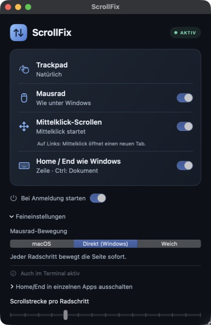

# ScrollFix — Windows-style mouse scrolling for Mac

**Reverse mouse scroll direction on macOS. Keep your trackpad natural. Middle-click to autoscroll or open a link in a new tab.**

ScrollFix is an open-source Mac menu bar app for people who prefer Windows mouse behavior. macOS shares its Natural scrolling setting between mouse and trackpad. ScrollFix corrects recognized mouse-wheel input separately, with immediate wheel movement by default.

[Installation guide](docs/INSTALL.md) · [Build from source](#build-and-install) · [Deutsch](docs/README.de.md) · [Troubleshooting](docs/TROUBLESHOOTING.md) · [Privacy](docs/PRIVACY.md) · [Support ScrollFix](https://ko-fi.com/eshok93)

### Help make ScrollFix as easy to install as a normal Mac app

> **€250 community goal** — toward a signed Mac download and continued improvements.
>
> Your tip helps fund Apple's developer membership, payment fees and further work on ScrollFix. The membership lets me sign the app and submit it to Apple's security checks.
>
> **Every one-time tip helps.** Choose €3, €10, €25 or your own amount on Ko-fi.
>
> [](https://ko-fi.com/eshok93)
>
> **ScrollFix stays free and open source.** Support is optional. You can also help by sharing the project or reporting a bug.



*ScrollFix 0.3.2: mouse scrolling, middle-click and Home/End. UI labels are currently German.*

## What ScrollFix does

- **Separate mouse and trackpad scroll direction:** keep natural trackpad gestures and classic mouse-wheel direction.
- **Windows-style mouse wheel:** each recognized wheel step moves the page immediately. Adjust the distance if needed.
- **Middle-click autoscroll:** click the wheel on ordinary content, move the pointer to scroll, then click again to stop.
- **Middle-click links:** recognized links keep their native click so the browser can open a new tab.
- **Start at login:** mouse correction, middle-click scrolling and login startup default to on at first launch.
- **Home/End like Windows:** line navigation and Shift selection in recognized text fields; Ctrl reaches document boundaries.
- **Terminal input selection:** set up local zsh directly in the app, then use Shift+Home/End in new terminals.
- **Work locally:** no account, analytics or network communication in the application.

ScrollFix also supports Home/End navigation and optional local zsh input selection. A global Ctrl/Cmd swap, Ctrl+wheel app zoom, Windows desktop shortcuts and display-quality changes are not included. See [Terminal setup and compatibility](docs/TERMINAL.md).

## Download and installation

**Current version: 0.3.2.** The source is updated; a verified DMG download is not available yet. The planned installer works like a normal Mac app: open the DMG, drag ScrollFix into Applications, then open it and allow macOS access. No Xcode or Terminal commands are needed with that download. [Simple installation guide](docs/INSTALL.md).

The maintainer still needs an Apple Developer ID certificate and notarization before publishing that DMG. Do not use the old preview expecting the features below.

## Build and install

The current features are available in the source. **The old [v0.1.0 preview](https://github.com/eShok93/ScrollFix/releases/tag/v0.1.0) does not include them.** It is ad hoc signed, not notarized, and predates the signing changes. No new verified binary release is available yet.

Requirements: **macOS 13 or newer**, **Swift 6**, and the macOS SDK from Xcode or Command Line Tools. The default build targets your Mac. Set `SCROLLFIX_BUILD_ARCHITECTURES=universal` for Apple Silicon and Intel; the old preview is Apple Silicon only.

```sh
git clone https://github.com/eShok93/ScrollFix.git
cd ScrollFix
./scripts/build-app.sh
```

Move `build/ScrollFix.app` to `/Applications`, then open it there. Keep the app at that location when using login startup. The script signs local builds ad hoc; it does not notarize them. Rebuilding changes that local identity and may require renewing ScrollFix's macOS permission. Do not disable Gatekeeper globally.

### First launch

1. Turn **Natural scrolling on** in macOS Trackpad settings.
2. Allow ScrollFix in **System Settings → Privacy & Security → Accessibility**, called **Device Control and Data Access** on some newer macOS versions. The app's **Zugriff erlauben** button opens that page.
3. Return to ScrollFix and check **AKTIV**. Test both the trackpad and mouse wheel once.

The default wheel mode is **Direkt (Windows)**. **Mausrad**, **Mittelklick-Scrollen** and **Bei Anmeldung starten** are enabled by default; saved choices are respected. macOS may also request permission to generate scroll movement for autoscroll or smooth scrolling. This means movement inside your apps, not sending data to a server.

### Terminal selection

In **Feineinstellungen**, click **Terminal einrichten** and confirm. ScrollFix backs up your startup file and installs the bundled module for your user. Open a new local zsh Terminal window afterward. No copied commands are required. Unsupported custom shell setups stay unchanged; see [compatibility and removal](docs/TERMINAL.md).

## Choose your mouse-wheel feel

| Mode in the app | Behavior |
| --- | --- |
| **macOS** | Keeps the native wheel distance, with ScrollFix's direction correction. |
| **Direkt (Windows)** | Moves immediately, with an adjustable minimum distance for small wheel steps. Default. |
| **Weich** | Spreads movement over frames for a soft start and short decay. |

**Feineinstellungen** is expanded by default. **Scrollstrecke pro Radschritt** adjusts the distance. These modes apply to recognized vertical line-wheel input; trackpad gestures, pixel-wheel streams and ambiguous input bypass the wheel-feel stage. Direct mode approximates the immediate feel of Windows, not an exact three-lines-per-notch setting across every app.

## Middle-click scrolling and browser tabs

Click the wheel on ordinary content to set an autoscroll anchor. Move the pointer away to scroll vertically or horizontally. Another click stops scrolling.

On a recognized link, ScrollFix passes the original middle click to the browser. The browser decides whether to open a new tab. Controls, modified clicks and uncertain targets also keep their native behavior. Incomplete Accessibility support or custom canvas content can prevent link recognition or autoscroll. No click is copied or replayed. The middle-click filter now runs independently of the interface, with recovery for interrupted clicks and a bounded lookup for deeply nested links.

## FAQ

### Can I reverse only the mouse wheel on a Mac?

Yes, for recognized wheel input. Leave macOS Natural scrolling on to preserve the trackpad's native direction, then enable ScrollFix's **Mausrad** option. ScrollFix reads the macOS preference without changing it.

### Does ScrollFix work with a Logitech free-spinning wheel?

Dense, recognized line-wheel input uses a shorter smooth response, and reversing direction cancels the previous tail. ScrollFix does not identify a Logitech model or detect its mechanical wheel mode. Pixel-based driver output can bypass wheel processing. Results depend on the mouse, driver and target app.

### Why does ScrollFix need macOS access?

It must intercept and change scroll movement across apps. Middle-click routing also checks Accessibility roles to preserve link clicks. The enabled Home/End feature also observes keyboard keycodes and modifiers. It does not record typed text or transmit events over a network. The optional Terminal setup reads and preserves your local shell startup file. See the exact scope in [Privacy](docs/PRIVACY.md).

### Is the trackpad guaranteed to stay unchanged?

Device classification is heuristic: Quartz scroll phases and line-wheel events do not provide a documented per-event device identity. Unknown input passes through. High-resolution mice, unusual drivers, remote desktops and rapid device switches can remain ambiguous. Keep Natural scrolling on and test your own devices. Only vertical direction is corrected; another scroll utility can conflict.

## Development and verification

ScrollFix uses Swift and SwiftUI with no external package dependencies. Automated checks help prevent regressions; real mouse, trackpad and keyboard tests are also needed. Users do not need to install or run the test suite. [Developer verification details](CONTRIBUTING.md#verification).

[How it works](docs/HOW-IT-WORKS.md) · [Contributing](CONTRIBUTING.md) · [Release requirements](docs/RELEASING.md)

Local builds are development artifacts. A public binary release requires Developer ID signing, Apple notarization and the release checks described above. Production does not retain QA event histories. A few transient timing values remain in memory; see [Privacy](docs/PRIVACY.md).

## License

[Apache 2.0](LICENSE). License notices are in [NOTICE](NOTICE); technical references are documented in [Provenance](docs/PROVENANCE.md).
