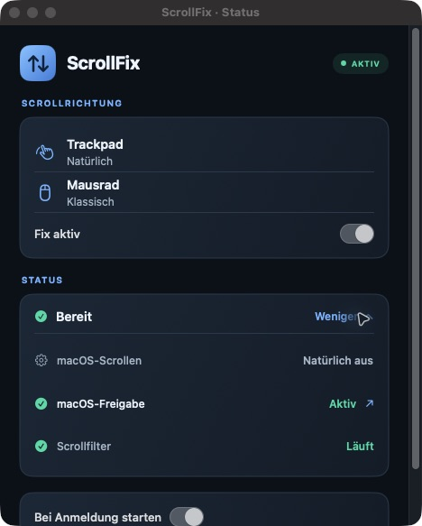
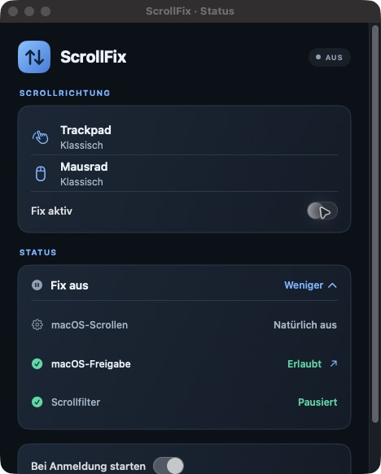

# ScrollFix

**Natural trackpad scrolling. Classic mouse-wheel scrolling. One small macOS menu-bar app.**

ScrollFix keeps the two directions separate without changing your macOS scrolling preference. It reads that preference, then corrects the device that needs it. The app is open source, runs locally, and has no network or telemetry code.

[Deutsch lesen](docs/README.de.md) · [How it works](docs/HOW-IT-WORKS.md) · [Troubleshooting](docs/TROUBLESHOOTING.md) · [Privacy](docs/PRIVACY.md)


<details>
<summary>More screenshots</summary>

| Status details | Fix off, macOS natural scrolling off |
| --- | --- |
|  |  |

</details>

## Get started

ScrollFix currently ships as **source code**. You need a Mac with macOS 13 or newer and Swift 6 with the macOS SDK (Xcode Command Line Tools or Xcode). On a Mac:

```sh
git clone https://github.com/eShok93/ScrollFix.git
cd ScrollFix
./scripts/build-app.sh
open build/ScrollFix.app
```

The script builds `build/ScrollFix.app`, adds the icon, and signs the bundle locally with an ad hoc signature. It does **not** notarize the app. Inspect the source and build script before granting macOS access. For a permanent location, move the app to `/Applications` before enabling **Bei Anmeldung starten**.

### First launch

1. Turn on **Fix aktiv** in ScrollFix.
2. Grant ScrollFix access in **System Settings → Privacy & Security → Accessibility**. On newer macOS versions, the permission page may be named **Device Control and Data Access**. The **macOS-Freigabe** row in ScrollFix opens the relevant page.
3. Return to ScrollFix. **AKTIV** and **Scrollfilter: Läuft** mean its event tap is running.
4. Scroll once with each device to confirm the result on your hardware. Enable **Bei Anmeldung starten** if you want the app at every login.

The menu-bar icon remains available after the settings window closes. Use **Fix aktiv** to turn the correction on or off. When it is off, both devices follow macOS's shared setting.

## What changes?

| macOS “Natural scrolling” | ScrollFix | Trackpad | Mouse wheel |
| --- | --- | --- | --- |
| Off | Off | Classic | Classic |
| Off | On | **Natural** | **Classic** |
| On | Off | Natural | Natural |
| On | On | **Natural** | **Classic** |

ScrollFix reads the macOS setting about every 1.5 seconds and switches its filter mode when that setting changes. It never writes the setting. The interface shows the current macOS baseline and the expected direction for each device.

## Permissions and trust

ScrollFix uses a Quartz session event tap for scroll-wheel and gesture events. macOS requires a broad system permission for this kind of input filtering. The app processes events in memory and does not write scroll history, send events over the network, or include analytics. Read the precise scope in [Privacy](docs/PRIVACY.md).

The local build is **ad hoc signed, not Developer ID signed or notarized**. This is a source-first project, not a verified binary release. The build uses a stable bundle identifier (`app.scrollfix.mac`) and designated requirement so local rebuilds can retain their permission identity. A distributable binary release would need a stable Developer ID signature and Apple notarization.

## Limits

- Only vertical scrolling is corrected.
- The app distinguishes devices using discrete wheel ticks and recent two-finger gestures. Some high-resolution mice, unusual drivers, remote desktops, or fast device switches may be classified incorrectly.
- A Magic Mouse has a touch surface; its scrolling may differ from a mechanical wheel.
- Another scrolling utility can modify the same events and conflict with ScrollFix.
- A green **AKTIV** status confirms that the filter is running. It cannot prove how a specific mouse or trackpad feels; check both devices once.

See [Troubleshooting](docs/TROUBLESHOOTING.md) if a direction is still wrong.

## Build, contribute, and license

The application is a Swift package with a SwiftUI interface. Run `./scripts/build-app.sh` from this repository to create the app bundle. [How it works](docs/HOW-IT-WORKS.md) covers the design, and [Contributing](CONTRIBUTING.md) explains how to report device issues.

Licensed under [Apache 2.0](LICENSE). See [NOTICE](NOTICE) and [Provenance](docs/PROVENANCE.md) for the Scroll Reverser reference.
