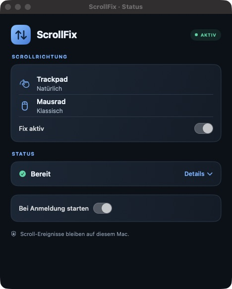

# ScrollFix

**Trackpad natürlich. Mausrad klassisch.** ScrollFix ist eine kleine macOS-Menüleisten-App, die beide Scrollrichtungen trennt. Sie liest die gemeinsame macOS-Einstellung und korrigiert je nach Ausgangslage das passende Gerät. Die Systemeinstellung selbst bleibt unverändert.

[English README](../README.md) · [Technik](HOW-IT-WORKS.md) · [Probleme lösen](TROUBLESHOOTING.md) · [Datenschutz](PRIVACY.md)



Weitere Ansichten: [Statusdetails](screenshots/scrollfix-status.jpg) · [Fix aus](screenshots/scrollfix-off.jpg)

## Installieren

Derzeit gibt es **Quellcode statt eines notarisierten Downloads**. Du brauchst macOS 13 oder neuer und Swift 6 mit macOS SDK (Xcode Command Line Tools oder Xcode):

```sh
git clone https://github.com/eShok93/ScrollFix.git
cd ScrollFix
./scripts/build-app.sh
open build/ScrollFix.app
```

Das Skript erzeugt `build/ScrollFix.app` und signiert sie lokal ad hoc. Für eine dauerhafte Installation verschiebe die App vor dem Aktivieren von **Bei Anmeldung starten** nach `/Applications`.

## Erster Start

1. Schalte **Fix aktiv** ein.
2. Erlaube ScrollFix unter **Systemeinstellungen → Datenschutz & Sicherheit → Bedienungshilfen**. Auf neueren macOS-Versionen heißt die Seite **Gerätesteuerung und Datenzugriff**. Die Zeile **macOS-Freigabe** in der App öffnet sie direkt.
3. Wechsle zu ScrollFix zurück. **AKTIV** und **Scrollfilter: Läuft** bedeuten, dass der Ereignisfilter läuft.
4. Prüfe die Richtung einmal mit Trackpad und Mausrad. Schalte danach bei Bedarf **Bei Anmeldung starten** ein.

Das Menüleistensymbol bleibt erreichbar, wenn du das Fenster schließt. Bei **Fix aus** folgen beide Geräte der gemeinsamen macOS-Einstellung.

## Was macht der Schalter?

| macOS „Natürliches Scrollen“ | ScrollFix | Trackpad | Mausrad |
| --- | --- | --- | --- |
| Aus | Aus | Klassisch | Klassisch |
| Aus | An | **Natürlich** | **Klassisch** |
| An | Aus | Natürlich | Natürlich |
| An | An | **Natürlich** | **Klassisch** |

ScrollFix liest die macOS-Grundeinstellung etwa alle 1,5 Sekunden neu. Im ausgeklappten Status siehst du diese Grundeinstellung, die Freigabe und den Filterzustand.

## Berechtigung und Grenzen

macOS verlangt für einen systemweiten Ereignisfilter eine weitreichende Freigabe. ScrollFix verarbeitet Scroll- und Gestenereignisse nur lokal im Arbeitsspeicher. Es gibt keinen Netzwerkcode, keine Telemetrie und kein Scrollprotokoll. Details stehen unter [Datenschutz](PRIVACY.md).

Die App korrigiert nur vertikales Scrollen. Hochauflösende Mausräder, ungewöhnliche Treiber, Remote-Desktop-Software und andere Scroll-Tools können die Geräteerkennung beeinflussen. **AKTIV** bestätigt den laufenden Filter, nicht das Gefühl an deiner konkreten Hardware. Siehe [Probleme lösen](TROUBLESHOOTING.md).

Der lokale Build ist **nicht von Apple notarisiert**. Eine offizielle Binärveröffentlichung braucht eine Developer-ID-Signatur und Notarisierung. Der Quellcode steht unter [Apache 2.0](../LICENSE); Hinweise zur Vorlage stehen in [NOTICE](../NOTICE) und [Provenance](PROVENANCE.md).
